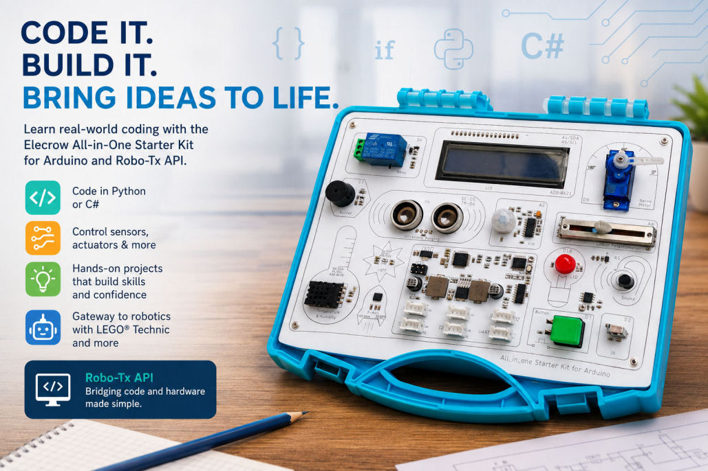

# Elecrow All-in-One Starter Kit for Arduino Coding Examples

This repository contains **Python** and **C# coding examples** for the Elecrow All-in-One Starter Kit for Arduino. These examples demonstrate how to control hardware components using the **Robo-Tx API**, which provides a bridge between the desktop computer and the Arduino microcontroller in the all-in-one kit.



The projects are designed for **beginners and students**, with structured examples and **coding challenges** that reinforce learning and build confidence.

---

## 🚀 Overview

The Elecrow All-in-One Starter Kit includes a variety of sensors and actuators (LEDs, buzzers, buttons, displays, etc.). Traditionally, these are programmed directly on the Arduino using embedded C/C++.

This repository introduces a different approach:

* Use [**Robo-Tx firmware**](https://github.com/kashif-baig/RoboTx_Firmware) on the Arduino
* Control hardware using **Python or C# from your computer**
* Focus on **logic, problem-solving, and software development skills**

---

## 🔧 Prerequisites

Before running any examples, ensure the following are set up correctly.

### 1. Install Robo-Tx Firmware on the All-in-One Starter Kit for Arduino

You must first deploy the firmware from:

* [RoboTx_Firmware](https://github.com/kashif-baig/RoboTx_Firmware)
* Install and use [Arduino IDE](https://www.arduino.cc/en/software) on your computer to perform deployment

This firmware enables communication between the user's computer and the Arduino.

---

### 2. Install .NET Runtime

* Install **.NET 8.0 or later** from:

  * [.NET](https://dotnet.microsoft.com/en-us/download)

This is required for running the Python and C# examples via the Robo-Tx API.

---

### 3. Python Setup

To run Python examples:

* Install **Python (≤ 3.13)**

  * [Python](https://www.python.org/downloads/)

* Install Pythonnet in the selected Python environment:

  * [pythonnet](https://pypi.org/project/pythonnet/)

```
pip install pythonnet
```

Open the repo using VS Code (see next step) and create a Python environment, within which pythonnet can be installed. Pythonnet allows Python to interact with the Robo-Tx .NET-based API.

---

## 💻 Recommended Development Environment

It is strongly recommended to use:

* [Visual Studio Code](https://code.visualstudio.com/download)

### Why Visual Studio Code?

Visual Studio Code (VS Code) is ideal because:

* Lightweight and fast
* Supports both **Python and C# in one environment**
* Excellent debugging tools
* Integrated terminal
* Rich extension ecosystem

---

### 🔌 Required VS Code Extensions

Install the following extensions:

#### For Python

* Python Extension for VS Code
* Pylance

#### For C#

* C# Dev Kit

---

## 📚 What Students Will Learn

The examples in this repository cover:

### Core Programming Concepts

* Variables and data types
* String formatting
* Conditional logic (if/else)
* Loops and iteration
* Working with timing and delays
* Functions and modular design
* Writing to files

### Hardware Interaction

* Reading and processing audio, optical, mechanical and environmental sensor inputs
* Controlling actuators (LED, buzzer, servo motor, display etc)

### Software Development Skills

* Debugging techniques
* Structuring code
* Interfacing between systems (PC ↔ Arduino)

---

## 🧠 Coding Challenges

The application examples (section 3) includes **hands-on challenges**, encouraging the learner to:

* Modify existing programs
* Think algorthmically
* Combine multiple ideas
* Ultimately build their own solutions

These challenges are essential for reinforcing learning and developing problem-solving skills.

---

## 🎓 GCSE Computer Science Alignment

The coding examples and challenges align closely with the **GCSE Computer Science curriculum**, including:

### 1. Algorithms & Problem Solving

* Designing step-by-step solutions
* Translating logic into working code

### 2. Programming Techniques

* Sequence, selection, and iteration
* Use of variables and data structures
* Writing reusable functions

### 3. Computational Thinking

* Decomposition (breaking problems down)
* Abstraction (focusing on relevant details)
* Pattern recognition

### 4. Practical Programming Skills

* Debugging and testing
* Writing readable, maintainable code
* Understanding program flow

---

## 📈 How This Repository Boosts Student Confidence

Working through these examples helps students:

* **Bridge theory and practice**
  → See how abstract concepts control real-world devices

* **Gain immediate feedback**
  → Hardware responses (LEDs, buzzers) reinforce understanding

* **Develop independence**
  → Coding challenges encourage experimentation and exploration

* **Learn multiple languages**
  → Compare Python vs C# approaches to the same problem

* **Build transferable skills**
  → Skills apply directly to exams and future software projects

---

## 🤖 Beyond the all-in-one starter kit: Robotics Applications

The Robo-Tx ecosystem is not limited the all-in-one starter kit for Arduino.

It can also be used to learn **robotics programming**, including:

* Off-the-shelf robotics kits
* LEGO Technic-based systems

See additional examples here:

* [Python-for-Robotics-Simplified](https://github.com/kashif-baig/Python-for-Robotics-Simplified)

---

## 🔁 Python vs C# – Learning Benefits

This repository provides parallel examples in both languages:

| Python                      | C#                              |
| --------------------------- | ------------------------------- |
| Beginner-friendly syntax    | Strongly typed structure        |
| Rapid prototyping           | Industry-standard language      |
| Ideal for learning concepts | Ideal for scalable applications |

By using both, students:

* Understand **language-agnostic concepts**
* Learn **different programming paradigms**
* Build flexibility and adaptability

---

## 🧪 Quick Review to Getting Started

1. Connect your Elecrow kit to your computer
2. Upload Robo-Tx firmware to the kit using Arduino IDE
3. Install .net, Python and VS Code on your computer
4. Open this repository in VS Code
5. Use VS Code to create a local Python environment
6. Install Pythonnet in the newly created environment
7. Run Python or C# examples
8. Complete the coding challenges

---

## 📌 Summary

This repository is more than just example code—it is a **learning pathway** that:

* Aligns with GCSE Computer Science
* Builds real-world programming skills
* Introduces hardware and robotics concepts
* Develops confidence through hands-on experimentation

---

## 🙌 Contributions

Contributions, improvements, and additional challenges are welcome!

---
