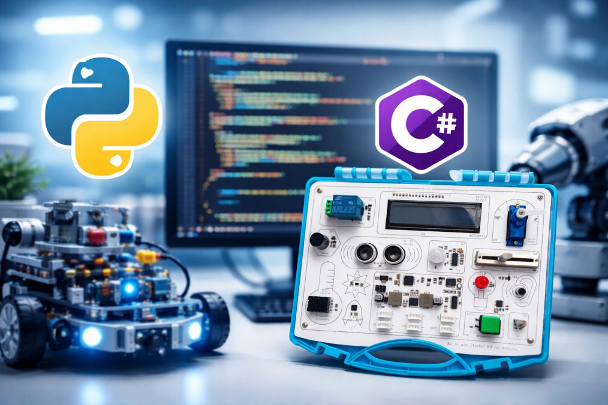

# Elecrow All-in-One Starter Kit for Arduino Coding Examples

This repository contains **Python** and **C# coding examples** for the Elecrow All-in-One Starter Kit for Arduino. These examples demonstrate how to control hardware components using the **Robo-Tx API**, which provides a bridge between the desktop computer and the Arduino microcontroller in the all-in-one kit.

The projects are designed for **beginners and students**, with structured examples and **coding challenges** that reinforce learning and build confidence.

---

## 🚀 Overview

The Elecrow All-in-One Starter Kit includes a variety of sensors and actuators (LEDs, buzzers, buttons, displays, etc.). Traditionally, these are programmed directly on the Arduino using embedded C/C++.

This repository introduces a different approach:

* Use [**Robo-Tx firmware**](https://github.com/kashif-baig/RoboTx_Firmware) on the Arduino
* Control hardware using **Python or C# from your computer**
* Focus on **logic, problem-solving, and software development skills**

For students who don't have the All-in-One Starter Kit but want to learn how to program it using Python, consider enrolling on the [**Python Programming: Robotics Foundation Course**](https://www.cohesivecomputing.co.uk/python-programming-robotics-foundation-course/).

---

## 🔧 Prerequisites

Before running any examples, ensure your Elecrow All-in-One starter kit and computer are properly configured. It is only necessary to install software if not already installed.

### 1. Install Robo-Tx Firmware on the All-in-One Starter Kit for Arduino

You must first deploy the firmware:

* Install [**Arduino IDE**](https://www.arduino.cc/en/software) on your computer;
* Download and unzip [**RoboTx_Firmware**](https://github.com/kashif-baig/RoboTx_Firmware);
* Locate the .ino file in the unzipped folder and open it using the Arduino IDE;
* Make sure the All-in-One kit is connected to the computer's USB port;
* In the Arduino IDE, select the *Arduino Uno* as the board, making sure that it shows as connected to the correct USB port;
* Upload the firmware using the Arduino IDE.

This firmware enables communication between the user's computer and the Arduino.

---

### 2. Install .NET SDK

* Install [**.NET 8.0 or later**](https://dotnet.microsoft.com/en-us/download) on to your computer.

This is required for running both C# and Python programs with the API that communicates with the Robo-Tx firmware.

---

### 3. Install Powershell

* Install [**Powershell**](https://learn.microsoft.com/en-us/powershell/scripting/install/install-powershell-on-windows?view=powershell-7.6) if not already installed on your computer.

This is needed for running scripts to configure your Python environment.

---

### 4. Python Setup

To run Python examples:

* Install [**Python (≤ 3.14)**](https://www.python.org/downloads/) on to your computer.

Please note the version number of your Python installation.

---

### 5. Install Visual Studio Code (VS Code)

It is strongly recommended to install and use VS Code as your development environment:

* Install [**Visual Studio Code**](https://code.visualstudio.com/download);
* Install [**Python**](https://marketplace.visualstudio.com/items?itemName=ms-python.python) and [**Pylance**](https://marketplace.visualstudio.com/items?itemName=ms-python.vscode-pylance) extensions, if running the Python examples; or
* Install [**C# Dev Kit**](https://marketplace.visualstudio.com/items?itemName=ms-dotnettools.csdevkit) extensions, if running the C# examples.

#### Why Visual Studio Code?

Visual Studio Code is ideal because:

* Lightweight and fast
* Excellent support for Python
* Integrated terminal
* Rich extension ecosystem

---

### 6. Before Running the Python Code

After the computing environment and Elecrow All-in-One Starter kit have been configured, download this repo and create a Python virtual environment for it using the steps below.

* Download the ZIP for this repo and extract to a folder on your computer;
* In the extracted folder, locate the Powershell script *create-venv.ps1* and open using Visual Studio Code. This script will create a Python virtual environment and install the package [Pythonnet]((https://pypi.org/project/pythonnet/));
* Run the script of the previous step by clicking the Run icon, usually at the top right of the VS Code window. If it fails, delete .venv folder (if created), and try running the script again.

Once all the steps have been successfully completed, the computing environment will be ready for developing and running Python programs against the Elecrow All-in-One Starter kit.

To run a particular Python example from the repo:

* Open the extracted folder using Visual Studio Code;
* Set the variable *serial_port* in file *app_config.py* to the serial port the All-in-One kit is connected to;
* Select the Python file of interest and click the Run icon.

---

## 🎓 Aligns With Computer Science Taught in High School or College

The coding examples and challenges align closely with the **Computer Science curriculums**, including:

### 1. Algorithms & Problem Solving

* Designing step-by-step solutions
* Translating logic into working code

### 2. Programming Techniques

* Sequence, selection, and iteration
* Use of variables and data structures
* Writing reusable functions

### 3. Computational Thinking

* Decomposition (breaking problems down)
* Abstraction (focusing on relevant details)
* Pattern recognition

### 4. Practical Programming Skills

* Debugging and testing
* Writing readable, maintainable code
* Understanding program flow

---

## 🧠 Coding Challenges

The application examples (section 3) includes **hands-on challenges**, encouraging the learner to:

* Modify existing programs
* Think algorthmically
* Combine multiple ideas
* Ultimately build their own solutions

These challenges are essential for reinforcing learning and developing problem-solving skills.

---

## 🤖 Beyond the All-in-One starter kit: Robotics Applications

The Robo-Tx ecosystem is not limited the all-in-one starter kit for Arduino.

It can also be used to learn **robotics programming**, including:

* Off-the-shelf robotics kits
* LEGO Technic-based systems

See additional examples here:

* [Python-for-Robotics-Simplified](https://github.com/kashif-baig/Python-for-Robotics-Simplified)

---

## 🔁 Python vs C# – Learning Benefits

This repository provides parallel examples in both languages:

| Python                      | C#                              |
| --------------------------- | ------------------------------- |
| Beginner-friendly syntax    | Strongly typed structure        |
| Rapid prototyping           | Industry-standard language      |
| Ideal for learning concepts | Ideal for scalable applications |

By using both, students:

* Understand **language-agnostic concepts**
* Learn **different programming paradigms**
* Build flexibility and adaptability

---

## 🧪 Quick Review to Getting Started

1. Connect your Elecrow kit to your computer;
2. Upload Robo-Tx firmware to the kit using Arduino IDE;
3. Install .net, Python and VS Code on your computer;
4. Download and open this repository in VS Code;
5. Use VS Code to create a local Python environment;
6. Modify the app_config.py or AppConfig.cs to use serial port the All-in-One kit is connected to;
7. Run the Python or C# examples; and
8. Complete the coding challenges.

---

## 🙌 Contributions

Contributions, improvements, and additional challenges are welcome!

---
